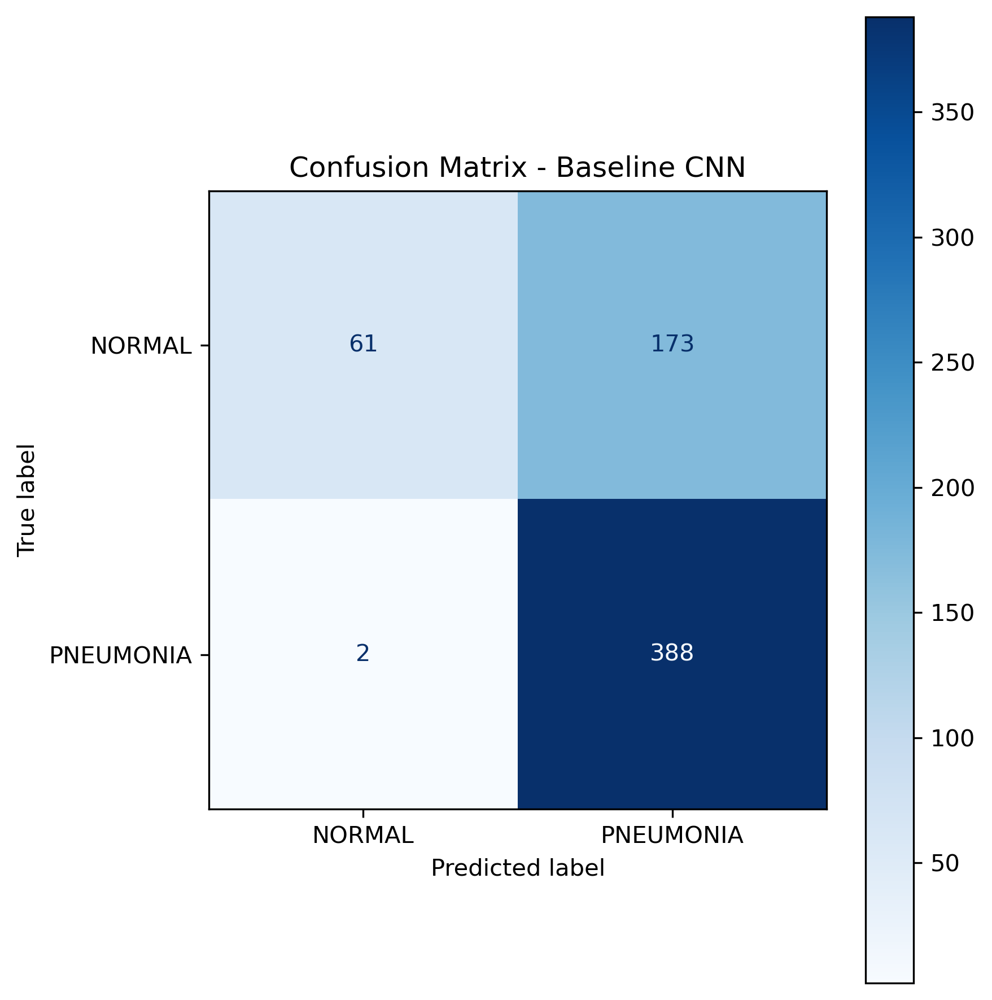
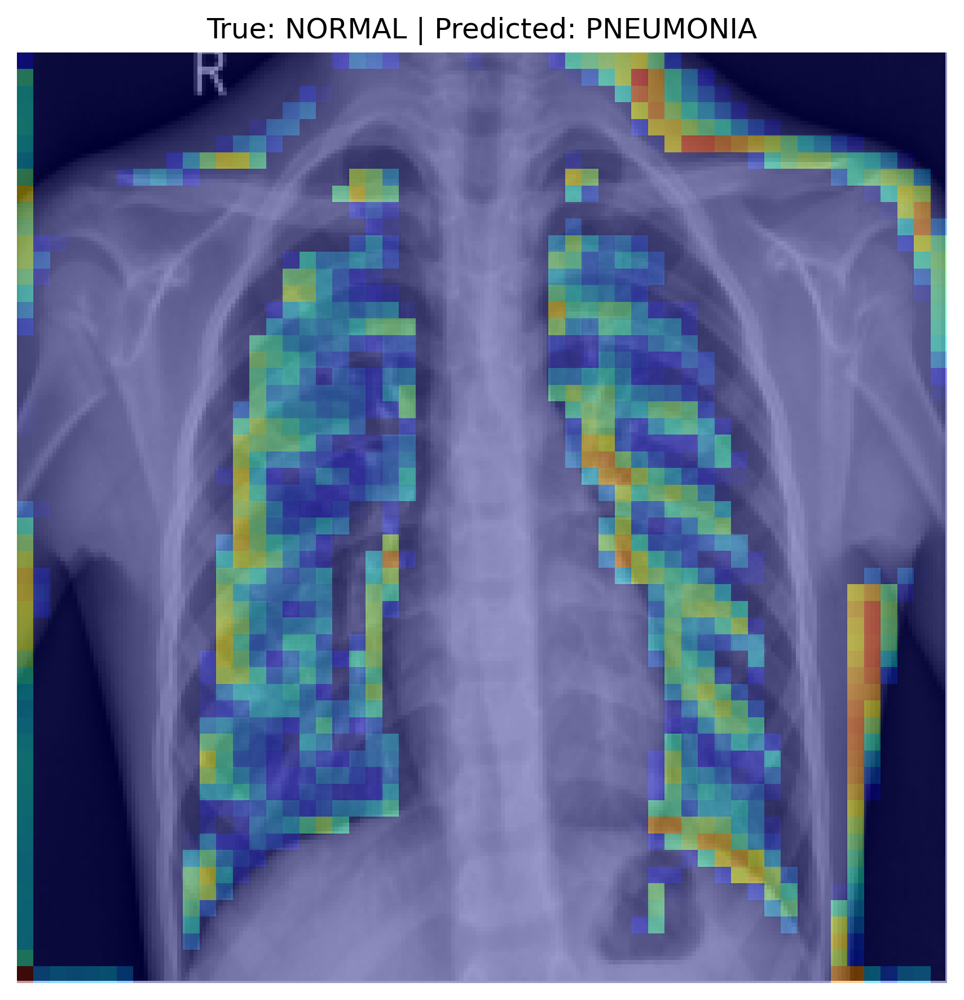

# Interpretable Chest X-ray Classification with CNNs and Grad-CAM

This project trains a convolutional neural network to classify chest X-rays as `NORMAL` or `PNEUMONIA` and uses Grad-CAM to inspect which image regions influence the model's predictions.

The goal is not only to evaluate classification performance, but also to examine whether the model appears to rely on medically relevant lung regions or possible dataset artifacts.

## Project Motivation

Chest X-ray classification is a common medical imaging task, but high accuracy alone does not guarantee that a model is learning clinically meaningful features. A model may rely on shortcuts such as image borders, brightness patterns, positioning, or dataset-specific artifacts.

This project uses Grad-CAM to visualize model attention and critically inspect the baseline CNN's predictions.

## Dataset

This project uses the Kaggle Chest X-Ray Images (Pneumonia) dataset.

The full dataset is not included in this repository because of file size and licensing considerations. See `data/README.md` for setup instructions.

## Method

The project follows four stages:

1. Dataset exploration
2. Baseline CNN training
3. Model evaluation
4. Grad-CAM interpretability analysis

The baseline CNN was trained from scratch using grayscale chest X-rays resized to `224 × 224`.

## Results

The baseline CNN achieved:

- Test accuracy: `71.96%`
- Test loss: `1.9030`

However, the confusion matrix showed a strong bias toward predicting `PNEUMONIA`.

| Class | Precision | Recall | F1-score |
|---|---:|---:|---:|
| NORMAL | 0.97 | 0.26 | 0.41 |
| PNEUMONIA | 0.69 | 0.99 | 0.82 |

This shows why accuracy alone is insufficient for evaluating the model.

## Confusion Matrix



## Grad-CAM Interpretability

Grad-CAM was used to inspect which regions influenced the model's predictions. In false-positive cases, where normal X-rays were predicted as pneumonia, heatmaps sometimes highlighted both lung regions and non-lung areas such as borders, shoulders, or lower image regions.

This suggests that the baseline CNN may partially rely on shortcut features or dataset-specific artifacts.



## Repository Structure

```text
notebooks/
  01_dataset_exploration.ipynb
  02_baseline_cnn_training.ipynb
  03_model_evaluation.ipynb
  04_gradcam_interpretability.ipynb

src/
  model.py

outputs/
  figures/
    confusion_matrix.png
    gradcam_false_positive.png

data/
  README.md
```

## How to Run

Install dependencies:

```bash
pip install -r requirements.txt
```

Download the dataset from Kaggle and place it as described in `data/README.md`.

Then run the notebooks in order:

```text
01_dataset_exploration.ipynb
02_baseline_cnn_training.ipynb
03_model_evaluation.ipynb
04_gradcam_interpretability.ipynb
```

## Notes

This is a learning and interpretability project, not a diagnostic medical system. The model is a baseline CNN and should not be used for clinical decision-making.